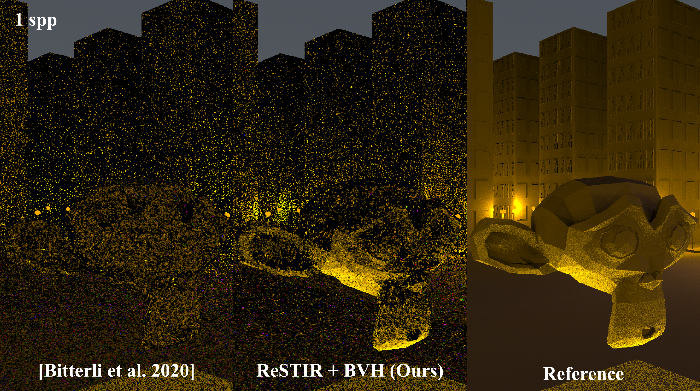
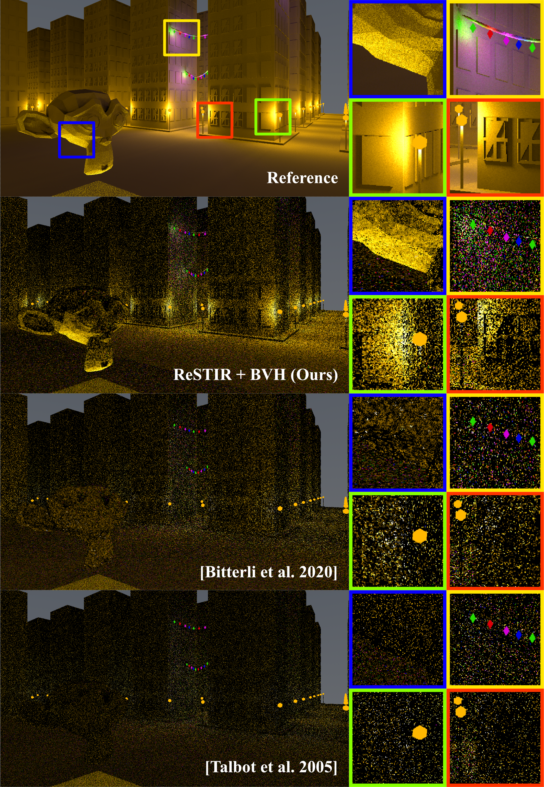

## A Better Light Candidate Generation Algorithm for ReSTIR Ray Tracing Using an Acceleration Structure to Identify Relevant Lights

**Author:** Rafayel Gardishyan

**Supervisors:** Christoph Peters, Michael Weinmann, Elmar Eisemann


*Render of the Night Cityscape scene. Comparison of the first frame between the original ReSTIR paper, our method and a reference render. Rendered with $M=23$, *1* sample per pixel*

This thesis is available at http://repository.tudelft.nl/ **not yet published**

#### Abstract

The efficient rendering of scenes with many light sources remains one of the most challenging problems in real-time ray tracing. As the complexity of virtual environments continues to increase with some scenes containing thousands of light sources, traditional Monte Carlo methods struggle to achieve acceptable noise levels under real-time constraints. This paper introduces a novel approach that combines Reservoir-based Spatiotemporal Importance Resampling (ReSTIR) with a specialised bounding volume hierarchy (BVH) structure to enhance light candidate generation for scenes with many light sources. The BVH-assisted candidate generation is tested on multiple scenes, resulting in a
significant decrease in image noise levels measured with the root mean squared metric (RMSE), along with improved visual quality from the first frame onward, especially in scenes with numerous light sources.


*The Night Cityscape scene. First frame comparison. Rendered with $M = 32$, $k = 8$ neighbours for spatial reuse in a radius of $5$, $1$ sample per pixel.*

## Run Instructions

Models:
- Download the models from [here](https://drive.google.com/file/d/1yWRJ4xpU4_av1yfLDOBh9l7P7jZHJz5U/view?usp=sharing) and extract the zip into the `objects` folder. (Feel free to use your own models, as long as all light sources are emmissive triangles)

Dependencies:
- The SDL2 library; [Installation Guide](https://wiki.libsdl.org/SDL2/Installation)
- Intel® embree; [Official Site](https://www.embree.org/)
- Make sure OpenMP is in the build path
- All other used libraries are bundled

Building:
```shell
$ mkdir build
$ cd build
$ cmake ..
$ make -j(nproc)
```

Running:
```shell
$ ./BVHCandidateGeneration
```
or, if not in `build` dir anymore
```shell
$ build/BVHCandidateGeneration
```

## Controls

|  | Action|
|---|---|
|Move `mouse`| Look around|
|`w`,`a`,`s`,`d`| Move around|
|`space`| Move up|
|`ctrl`| Move down|
|`shift`| Speed up movement|
|`1`| Uniform Importance Sampling|
|`2`| Resampled Importance Sampling[[Talbot et al. 2005]](https://dl.acm.org/doi/10.5555/2383654.2383674)|
|`3`| ReSTIR[[Bitterli et al. 2020]](https://doi.org/10.1145/3386569.3392481)|
|`4`| ReSTIR + BVH-based candidate generation (Ours)|
|`enter`| Render current camera|
|`p`| Enable/Disable accumulation|
|`u`| Render all methods|

## Changing Scenes
To change the scenes, please edit the `load_world()` function in [`world.cpp`](https://github.com/RafayelGardishyan/BVH-based-Light-Candidate-Generation/blob/main/world.cpp)
